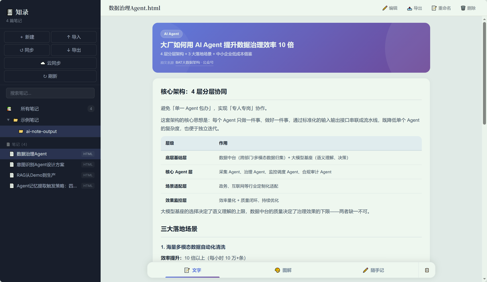
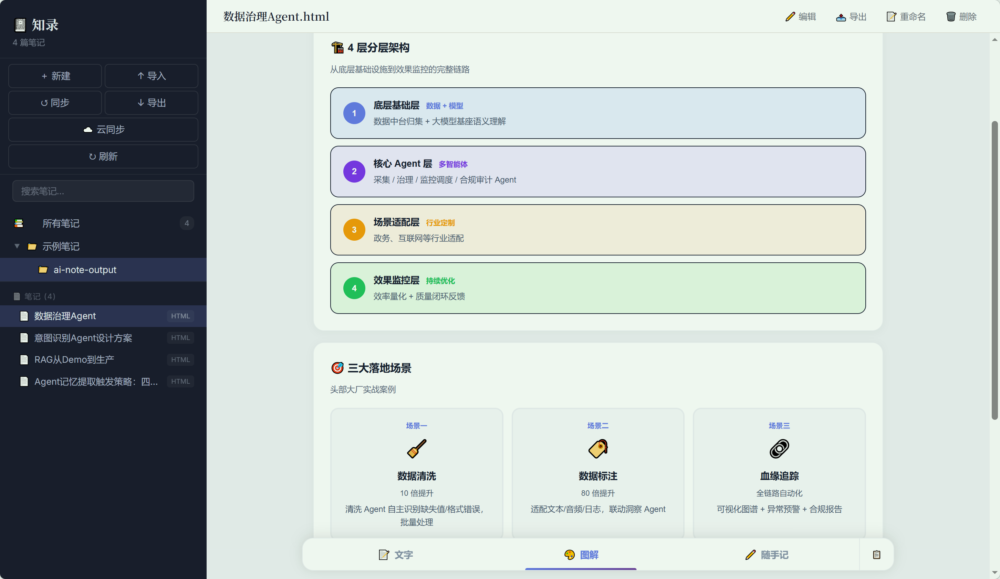

# 📓 知录 · 笔记

**知录** 是一款轻量级笔记管理 PWA 应用，专为浏览和管理 [ai-note](https://github.com) 生成的 HTML 双页签笔记而设计。

> 📖 **[完整使用指南 →](docs/guide.md)** — 包含安装、操作、常见问题等详细说明

## ✨ 功能

| 功能 | 说明 |
|---|---|
| 📂 **文件夹管理** | 树形目录，支持新建、重命名、递归删除 |
| 📄 **笔记管理** | 导入、预览、重命名、删除、搜索 |
| 🔍 **全文搜索** | 实时搜索笔记名称 |
| ✏️ **可视化编辑** | 所见即所得编辑，支持加粗、斜体、列表、标题等 |
| 🔧 **源码编辑** | 直接编辑 HTML 源码，随时切换 |
| 📥 **批量导入** | 拖拽或选择文件批量导入 HTML 笔记 |
| 🤖 **智能同步** | 从文件夹导入，自动去重、保留层级结构 |
| 📤 **导出备份** | 单篇导出或全量导出 |
| 📱 **安装到桌面** | 可安装到桌面，离线可用，接近原生体验 |
| 🎨 **视觉设计** | 深蓝侧边栏 + 浅色阅读区，清晰的信息层级 |

## 🖼️ 界面预览

知录专为 ai-note 生成的双页签笔记设计，以下为实际运行的笔记截图：

| 文字 | 图解 |
|---|---|
|  |  |

> 点击在线体验：[示例笔记 — Agent 记忆提取触发策略](https://zzc178178.github.io/claude-skills/examples/Agent%E8%AE%B0%E5%BF%86%E6%8F%90%E5%8F%96%E8%A7%A6%E5%8F%91%E7%AD%96%E7%95%A5%EF%BC%9A%E5%9B%9B%E5%A4%A7%E6%A1%86%E6%9E%B6%E5%AF%B9%E6%AF%94.html)

## 🚀 快速开始

### 在线使用

打开在线链接即可使用（需要部署到 HTTPS 服务器）：

```
https://zzc178178.github.io/zhilu-note/zhilu.html
```

### 本地运行

```bash
cd zhilu-note
python -m http.server 8899
# 浏览器打开 http://localhost:8899/zhilu.html
```

### 安装到桌面

| 设备 | 操作 |
|---|---|
| **Android Chrome** | 地址栏安装图标 ⊕ → 安装知录 |
| **iPhone Safari** | 分享按钮 → 添加到主屏幕 |
| **桌面 Chrome/Edge** | 地址栏安装图标 ⊕ → 安装知录 |

## 🧩 安装到桌面

- Chrome/Edge 地址栏右侧点安装图标 → 像原生应用一样使用
- 离线可用，无需网络即可浏览笔记

## 🛠 技术栈

| 技术 | 用途 |
|---|---|
| **原生 HTML/CSS/JS** | 单页应用，无框架依赖 |
| **IndexedDB** | 本地数据存储 |
| **PWA / Service Worker** | 离线缓存 + 桌面安装 |
| **ContentEditable** | 可视化编辑 |
| **GitHub Pages** | 在线部署 |

## 📚 相关项目

- **[ai-note](https://github.com)** — 生成 AI 双页签图文笔记的 HTML 输出工具，知录是其配套阅读器

## 📄 License

MIT
